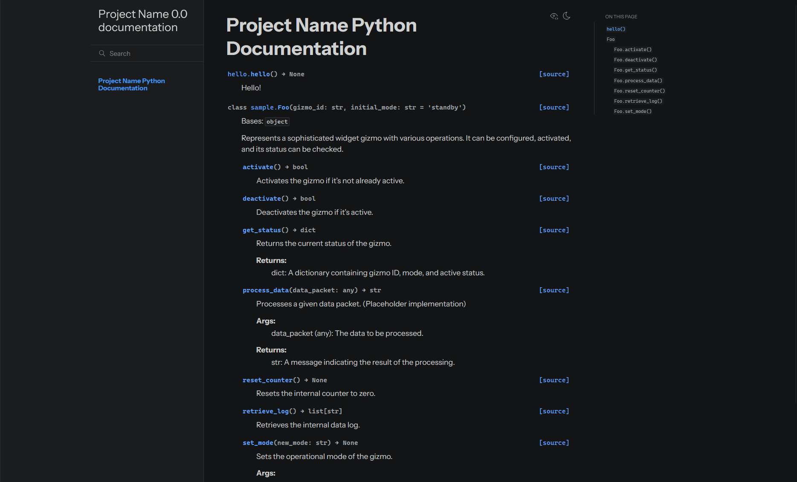

# AutoDocs


A rough and quick setup script for Doxygen -> Breathe -> Sphinx documentation pipelines.

AutoDocs simplifies the setup of a Doxygen, Breathe, and Sphinx documentation pipeline, allowing the user to quickly generate professional-looking documentation for any Python and/or C++ projects with minimal configuration.

## Requirements

> [!WARNING]
> This script is primarily for Windows systems. This has only been tested in my environment. (Windows 11 24H2), though it might work for other environments, it's untested.

Ensure Python 3.9 or greater is installed in your system. To check, run:
```
python --version
```
>[!NOTE]
>If your project includes C++, ensure Doxygen is installed in your system. To check, run:
>```
>doxygen -v
>```
> Get Doxygen at [Doxygen](https://doxygen.nl/)'s homepage.

## Installation

Download the script under the [releases](https://github.com/a22Dv/releases) section of this repository. Place the script in the root directory of the project you want documentation in.

 It is recommended to run this script with a virtual environment due to the sheer number of dependencies `sphinx` requires. To create one, run:
```
python -m venv venv
```
in the directory of your project.

After activating with:
```
venv/scripts/activate
```

Inside the virtual environment, run:
```
pip install sphinx furo
```

Sphinx is the primary way this script generates the documents, with Furo being the theme installed. Though you can change this under Advanced Settings within the script.

### C++
This script also supports C++, Python, or both of them. If you need C++ support, make sure Doxygen is installed in your system. Then run: 
```
pip install breathe
```

## How to use
Open the script, and set the following variables according to your project's configurations:

> [!WARNING] 
> These settings are case-sensitive. Options are listed on top of the variables in the script itself.

```
CPP_PATH: Path = Path("src/cpp/")
PY_PATH: Path = Path("src/py/")
INCLUDE_PATH: Path = Path("include")
PROJECT_LANGUAGE: str = "Python/C++"
PROJECT_NAME: str = "Project Name"
AUTHOR_NAME: str = "Author Name"
PROJECT_RELEASE: str = "0.0"
LANGUAGE: str = "en"


FONT_FAMILY_MAIN: str = "Arial"
FONT_FAMILY_MONOSPACE: str = "Consolas"
THEME: str = "furo"
```

After doing so, run:
```
python autodocs.py
```

If you want to rebuild, run:
```
python autodocs.py -rb
```
or
```
python autodocs.py --rebuild
```

### Sample Output


### Disclaimer
>[!CAUTION]
> There are some issues within this script that might've slipped past me, as it has only been tested in my environment since this script is mostly for my own personal use.

## License

This project is licensed under the MIT License - see LICENSE for more details.

## Author

a22Dv - a22dev.gl@gmail.com


