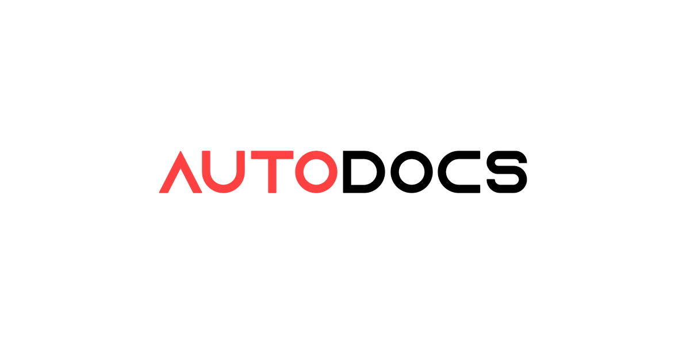

# AutoDocs




A rough and quick setup script for Doxygen -> Breathe -> Sphinx documentation pipelines.

## Requirements

This script is primarily for Windows systems. This has only been tested in my environment. (Windows 11 24H2)

Ensure Python 3.9 or greater is installed in your system. To check, run:
```
python --version
```
in your terminal.

## Installation

Download the script under the `releases` section of this repository. Place the script in the root directory of the project you want documentation in.

 It is recommended to run this script with a virtual environment due to the sheer number of dependencies `sphinx` requires. To create one, run:
```
python -m venv venv
```
in the directory of your project.

Inside the virtual environment, run:
```
pip install sphinx furo
```

## Language Support

### Python
If you only need Python support, you can skip this section, Sphinx is enough.

### C++
This script also supports C++, Python, or both of them. If you need C++ support, make sure Doxygen is installed in your system. You can do so at [Doxygen](https://doxygen.nl/)'s homepage. Then run: 
```
pip install breathe
```

## How to use
Open the script, and set the following variables according to your project's configurations:

```
CPP_PATH: Path = Path("src/cpp/")
PY_PATH: Path = Path("src/py/")
INCLUDE_PATH: Path = Path("include")
PROJECT_LANGUAGE: str = "Python/C++"
PROJECT_NAME: str = "Project Name"
AUTHOR_NAME: str = "Author Name"
PROJECT_RELEASE: str = "0.0"
LANGUAGE: str = "en"


FONT_FAMILY_MAIN: str = "Arial"
FONT_FAMILY_MONOSPACE: str = "Consolas"
THEME: str = "furo"
```

After doing so, run:
```
python autodocs.py
```

If you want to rebuild, run:
```
python autodocs.py -rb
```
or
```
python autodocs.py --rebuild
```


## Issues

### Disclaimer
There are quite a lot of issues within this script that might've slipped past me, it has only been tested in my environment and for my usage as this script is mostly for my own personal use.

## License

This project is licensed under the MIT License - see LICENSE for more details.

## Author

a22Dv - a22dev.gl@gmail.com


